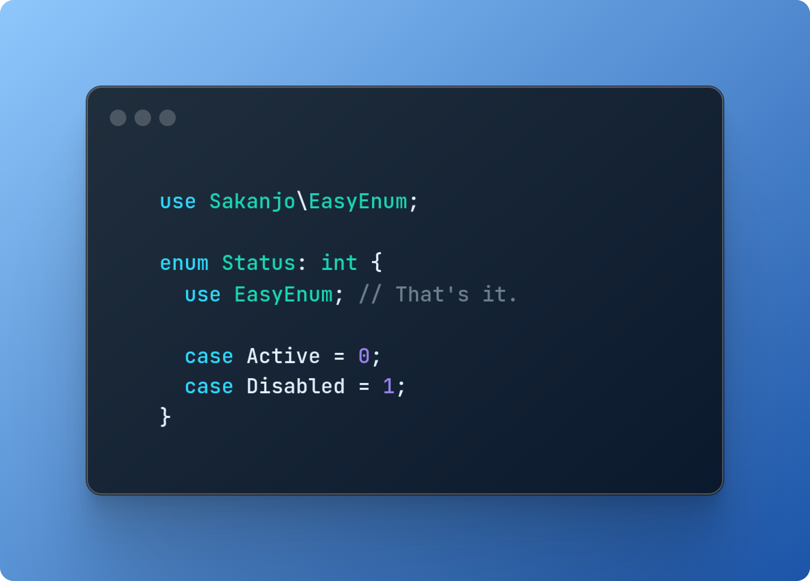

<h1 align="center">🔥 Easy enum</h1>

<p align="center">
    <a href="https://github.com/sakanjo/laravel-easy-enum/actions"></a>
    <a href="https://laravel.com"></a>
    <a href="https://php.net"></a>
</p>

<p align="center">Easily work with enums.</p>

> ✨ Help support the maintenance of this package by [sponsoring me](https://github.com/sponsors/sakanjo).

> Designed to work with **Laravel**, **Filament**, and more.



Table of Contents
=================

* [Install](#-install)
* [Usage](#-usage)
  * [1. Create enum](#1-create-enum)
  * [2. Create lang file](#2-create-lang-file)
* [Methods](#-methods)
  * [getLabel](#getlabel)
  * [is](#is)
  * [isNot](#isnot)
  * [tryFromName](#tryfromname)
  * [fromName](#fromname)
  * [names](#names)
  * [values](#values)
  * [options](#options)
  * [toHtml](#tohtml)
* [Practical examples](#-practical-examples)
     * [Filamentphp](#filamentphp)
        * [Enum](#enum)
        * [Resource](#resource)
     * [Laravel blade](#laravel-blade)
* [Support the development](#-support-the-development)
* [Credits](#%EF%B8%8F-credits)
* [License](#-license)

## 📦 Install

```
composer require sakanjo/laravel-easy-enum
```

## 🦄 Usage

### 1. Create enum

```php
<?php

namespace App\Enums;

use SaKanjo\EasyEnum;

enum ExampleEnum: int
{
    use EasyEnum;

    case Active = 0;
    case NOPE = 1;
}
```

### 2. Create lang file

```php
// lang/en/enums.php

<?php

use App\Enums;

return [
    Enums\ExampleEnum::class => [
        Enums\ExampleEnum::NOPE->name => 'Nope',
        // ...
    ],
    
    // ...
];
```

That's it!

## 📚 Methods

### getLabel

Returns the label of the enum value.

```php
Status::Active->getLabel(); // Active
```

### is

Checks if the enum is equal to another one.

```php
$enum1->is($enum2); // boolean
```

### isNot

Checks if the enum is not equal to another one.

```php
$enum1->isNot($enum2); // boolean
```

### tryFromName

Safely converts a string to its corresponding enum value (returns null if not found).

```php
Status::tryFromName('Active'); // Status::Active
Status::tryFromName('Oops'); // null
```

Converts a string to its corresponding enum value (throws exception if not found).

### fromName

```php
Status::fromName('Active'); // Status::Active
Status::fromName('Oops'); // Throws ValueError exception
```

### names

Returns a list of case names.

```php
Status::names(); // ['Active', 'NOPE']
```

### values

Returns a list of case values .

```php
Status::values(); // [0, 1]
```

### options

Returns an associative array of case names and values.

```php
Status::options(); // ['Active' => 0, 'NOPE' => 1]
Status::options(true); // ['Active' => 0, 'Nope' => 1]
```

### toHtml

alias for `getLabel`, useful in blade.

```php
Status::Active->toHtml(); // Active
```

## 🔥 Practical examples

#### Filamentphp

##### Enum

```php
<?php

namespace App\Enums;

use Filament\Support\Contracts\HasLabel;
use SaKanjo\EasyEnum;

enum Status: int implements HasLabel
{
    use EasyEnum;

    case Active = 0;
    case Disabled = 1;
}
```

##### Resource

```php
<?php

use Filament\Forms;
use App\Enums;

Forms\Components\Select::make('status')
    ->options(Enums\Status::class);
```

#### Laravel blade

```php
<?php

namespace App\Enums;

use Illuminate\Contracts\Support\Htmlable;
use SaKanjo\EasyEnum;

enum Status: int implements Htmlable
{
    use EasyEnum;

    case Active = 0;
    case Disabled = 1;
}
```

```php
<div>
    Current status: {{ auth()->user()->status }}
</div>
```

## 💖 Support the development

**Do you like this project? Support it by donating**

Click the ["💖 Sponsor"](https://github.com/sponsors/sakanjo) at the top of this repo.

## ©️ Credits

- [Salah Kanjo](https://github.com/sakanjo)
- [All Contributors](../../contributors)

## 📄 License

[MIT License](https://github.com/sakanjo/laravel-easy-enums/blob/master/LICENSE) © 2023-PRESENT [Salah Kanjo](https://github.com/sakanjo)
